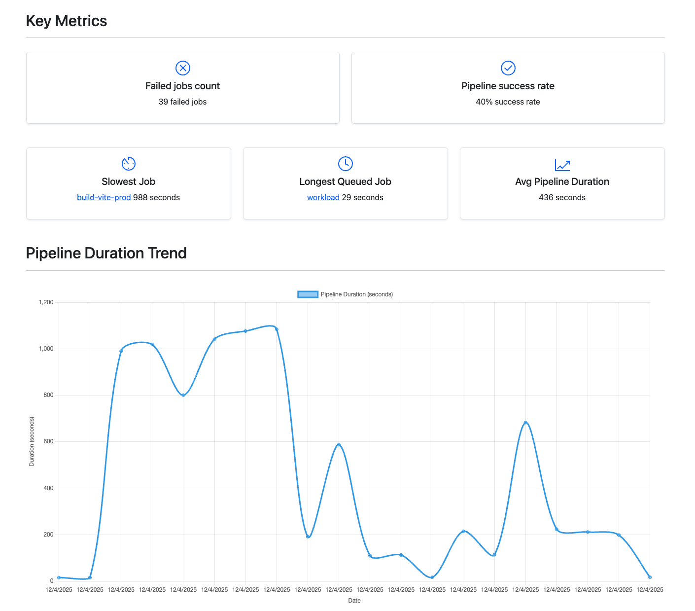

# Pipeline Performance Analyzer


Analyze and visualize your GitLab CI/CD pipeline performance with key metrics and trends.

## Live App

Use the fully functional app here:

[Open the Pipeline Performance Analyzer](https://pipeline-performance.netlify.app/)



## Features

- 📊 Pipeline duration trend chart
- 📈 Key performance metrics
- 🔐 Secure token authentication

## Development

```sh
# Install dependencies
npm install

# Run tests
npm run test:unit

# Run linting
npm run lint

# Build for production
npm run build
```
